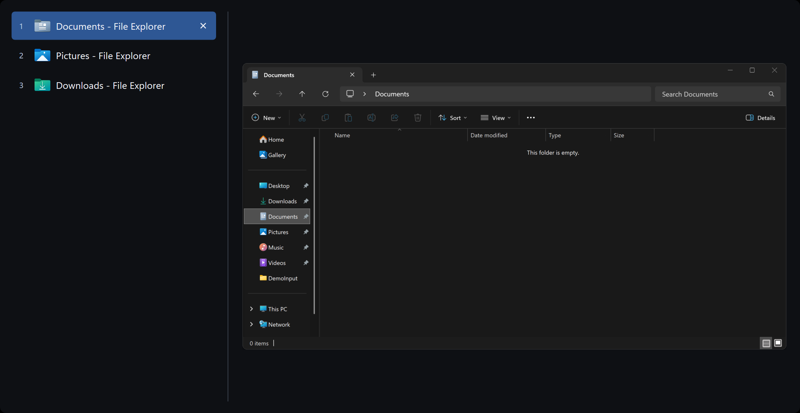

# AltTabio

A free, open-source window switcher. It replaces Alt+Tab on 64-bit Windows 10 and 11 and Cmd+Tab on macOS 26 and later.

[Website](https://vibeslop.github.io/AltTabio/) · [Download](https://github.com/vibeslop/AltTabio/releases/latest)



On Windows it shows a numbered list of open windows and a live preview of the selected one, and filters the list as you type. On macOS it lists every window of the selected app, including minimized windows, windows of hidden apps, and windows on other Spaces, which the system Cmd+Tab leaves out.

It was created because Alt+Tab Terminator has had a critical issue for years that causes Alt+Tab to stop working correctly. The issue was reported, but never fixed.

AltTabio is an independent project and is not affiliated with Alt+Tab Terminator.

## Install

### Windows

1. Download the Windows archive from [GitHub Releases](https://github.com/vibeslop/AltTabio/releases/latest).
2. Extract it to a folder that only administrators can change, such as `C:\Program Files\AltTabio`.
3. Run `AltTabio.exe` and accept the administrator prompt.

AltTabio needs administrator rights. With **Autostart** on, it gets them at every logon, and so would anyone who replaced `AltTabio.exe`. That is why it belongs in a folder only administrators can change.

### macOS

Paste this into Terminal:

```sh
curl -fsSL https://vibeslop.github.io/AltTabio/install.sh | sh
```

The script installs AltTabio in `/Applications` and starts it in the menu bar. AltTabio asks for [two permissions](https://vibeslop.github.io/AltTabio/mac/#permissions): Accessibility right away, and Screen Recording for previews after your first Cmd+Tab. It updates itself from then on.

AltTabio is not notarized, so macOS blocks a copy downloaded in a browser. The [Mac page](https://vibeslop.github.io/AltTabio/mac/#install) explains how to install it by hand anyway, and how to remove it.

## Keys

### Windows

| Input | Action |
| --- | --- |
| Alt+Tab or Win+Tab | Open the switcher and move through it |
| Arrow keys, Tab, Shift+Tab, or mouse wheel | Change the selected window |
| Enter or click | Switch to the selected window |
| 1-9, on the number row or the number pad | Switch to that window directly |
| Type | Filter by window title, app name, or number |
| Escape | Close the switcher |
| F4 to F9 | Close, minimize, maximize, or restore the selected window, end its process, or start another instance of its app |

### macOS

| Input | Action |
| --- | --- |
| Cmd+Tab | Open the switcher on the previous app; Tab and Shift+Tab step through the apps |
| Left, Right, or ` (backtick) | Previous or next app |
| Up, Down | The selected app's windows |
| 1-9 | Switch to that window of the selected app |
| Release Cmd, Return, or click | Switch to the selected window |
| W, M, H, or Q while holding Cmd | Close or minimize the window, or hide or quit the app |
| Right-click | More commands, including Force Quit |

Settings open from the tray icon on Windows and from the menu bar icon on macOS. The website lists every shortcut and setting for [Windows](https://vibeslop.github.io/AltTabio/windows/#shortcuts) and [macOS](https://vibeslop.github.io/AltTabio/mac/#shortcuts).

## Building

```sh
cargo build --release   # Windows: target\release\AltTabio.exe
scripts/mac/run.sh      # macOS: build target/mac/AltTabio.app and start it
```

[CONTRIBUTING.md](CONTRIBUTING.md) covers the checks a change must pass, the debug flags, and releasing.

## License

AltTabio is licensed under the [MIT License](LICENSE). Third-party components and their licenses are listed in [THIRD_PARTY_LICENSES.md](THIRD_PARTY_LICENSES.md).
